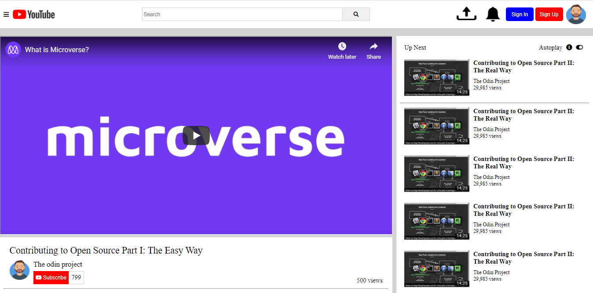

## Project Name
Youtube Clone

This is a simple youtube clone

Additional description about the project and its features.

## Built With
 
 - HTML
 - CSS

## Authors

👤 **Author1**

- Github: [@githubhandle](https://github.com/NtwaliHeritier)
- Twitter: [@twitterhandle](https://twitter.com/NtwaliHeritier)
- Linkedin: [linkedin](https://linkedin.com/in/ntwali-heritier-9950001a2)

👤 **Author2**

- Github: [@githubhandle](https://github.com/Nkuria)
- Twitter: [@twitterhandle](https://twitter.com/Nkuria3)
- Linkedin: [linkedin](https://linkedin.com/in/nick-kuria-a148931a9)

## 🤝 Contributing

Contributions, issues and feature requests are welcome!

Feel free to check the [issues page](issues/).

## Show your support

Give a ⭐️ if you like this project!

## Acknowledgments

- Hat tip to anyone whose code was used
- Inspiration
- etc

## 📝 License

This project is [MIT](lic.url) licensed.